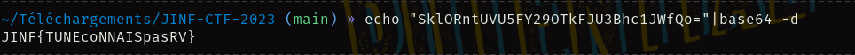
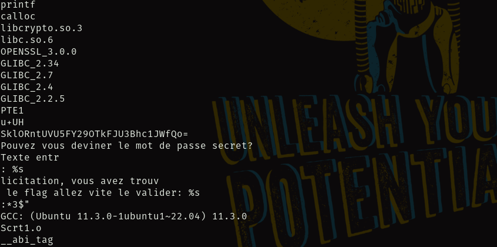
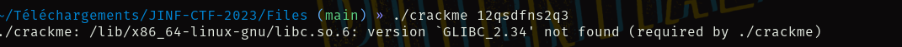
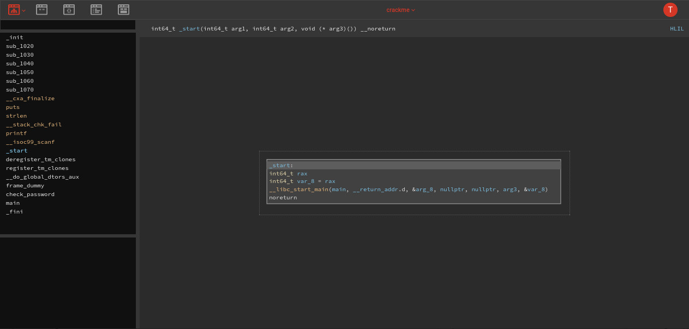
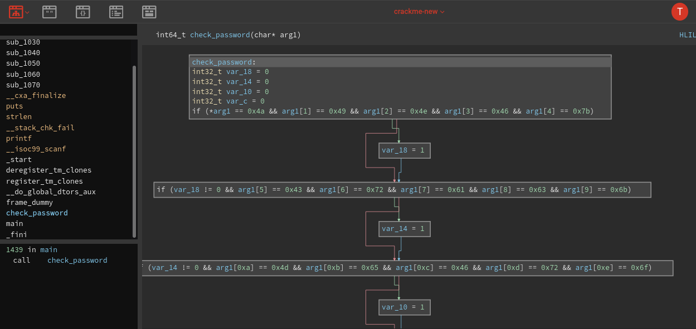
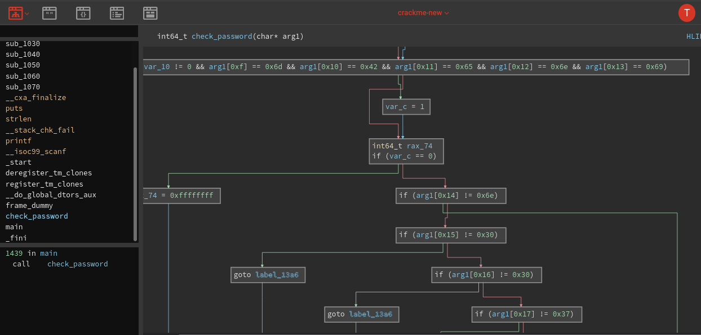
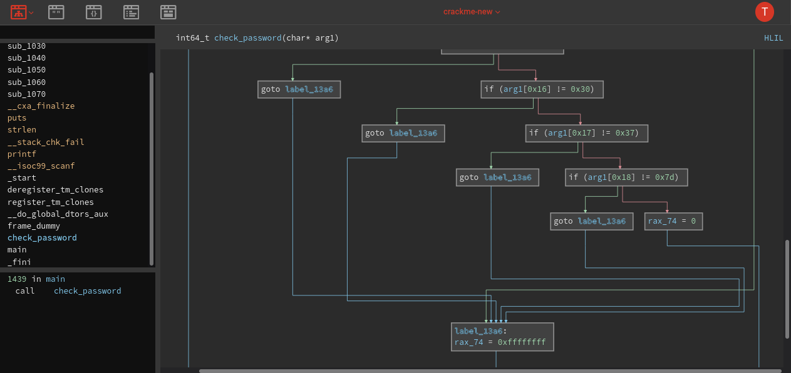

# JINF-CTF-2023 👨‍💻️

### Kira's_team 👨‍👨‍👦‍👦️
1. Kira `Captain` 👨‍✈️️
2. amo_weak 🕵️
3. Eddy 👨‍🔬️
4. Hyd3 🧙️

## Author: Hyd3 From Kira's_team

## Reverse Engineering Challenges
________________________________________________________
|Challenge		|Category	    	|Value  |
| ---------------------	|  ------------------	| ----- |
| La devinette          | Reverse Engineering	|  100  |
| Crack me		| Reverse Engineering	|  200  |
---------------------------------------------------------

	- La devinette
		- Premiere méthode
		- Seconde  méthode
	- Crack me
		- Premiere méthode
		- Seconde  méthode
		
#### Let's Go🏇️

## 1. La devinette
	

>	Premiere méthode

	
**Download** [pass](../Files/pass "pass") (Binary file)

1. Premiere méthode

>Tout d'abord pour savoir â quoi on doit s'attendre

```bash
file pass
```

`Output`:


Le binaire n'est pas strippé Dieu merci
>On ne s'agite pas on ne sait jamais ce qui peut se passer avec un binaire , on pourrait avoir des informations utiles dans les 
`strings`


```bash
strings pass
```


Lâ on peut voir toutes les sections contenues dans le binaire

En Faisant des recherches vous verrez que la section `.rodata` contient les données qui peuvent etre en clair dans le binaire 📦️

Nous allons donc utiliser la commande `objdump` qui se trouve de base sur la plupart des distributions GNU/Linux 📀️


```bash
objdump -d -j .rodata Files/pass
```
### **Explication des parametres**

> `-d` : pour effectuer le desassemblage


> `-j` : pour preciser la section voulue

`Output`:


Ce qui est interessant dans l'output est cette chaîne de caractere affichée avant le message .

```bash
Files/pass:     format de fichier elf64-x86-64


Désassemblage de la section .rodata :

0000000000002000 <_IO_stdin_used>:
    2000:	01 00 02 00 00 00 00 00 53 6b 6c 4f 52 6e 74 55     ........SklORntU
    2010:	56 55 35 46 59 32 39 4f 54 6b 46 4a 55 33 42 68     VU5FY29OTkFJU3Bh
    2020:	63 31 4a 57 66 51 6f 3d 00 00 00 00 00 00 00 00     c1JWfQo=........
    2030:	50 6f 75 76 65 7a 20 76 6f 75 73 20 64 65 76 69     Pouvez vous devi
    2040:	6e 65 72 20 6c 65 20 6d 6f 74 20 64 65 20 70 61     ner le mot de pa
    2050:	73 73 65 20 73 65 63 72 65 74 3f 0a 3a 00 25 73     sse secret?.:.%s
    2060:	00 0a 54 65 78 74 65 20 65 6e 74 72 c3 a9 3a 20     ..Texte entr..: 
    2070:	25 73 0a 00 00 00 00 00 46 c3 a9 6c 69 63 69 74     %s......F..licit
    2080:	61 74 69 6f 6e 2c 20 76 6f 75 73 20 61 76 65 7a     ation, vous avez
    2090:	20 74 72 6f 75 76 c3 a9 20 6c 65 20 66 6c 61 67      trouv.. le flag
    20a0:	20 61 6c 6c 65 7a 20 76 69 74 65 20 6c 65 20 76      allez vite le v
    20b0:	61 6c 69 64 65 72 3a 20 25 73 0a 00                 alider: %s..

```
`Output`:


> **Souvent** les chaines en base64 64 base32 se terminent par un signe `=`
On peut donc essayer de la decoder


```bash
echo "SklORntUVU5FY29OTkFJU3Bhc1JWfQo="|base64 -d
```
`Output`:

Et l'on peut voir s'afficher le flag 🔍️



`Flag: JINF{TUNEcoNNAISpasRV}`🏁️


>	Seconde méthode


```bash
strings pass
```

Apres cela fouiller dans l'output et vous verrez une chaîne en base64



```bash
echo "SklORntUVU5FY29OTkFJU3Bhc1JWfQo="|base64 -d
```

Et vous obtenez

`JINF{TUNEcoNNAISpasRV}` 🏴️


## 2. Crack me ☢️


Second chall's de Reverse.
 > **Download** [crackme](../Files/crackme "pass") (Binary file)

Dans ce cas j'ai décider d'utiliser un utiliser un outils en ligne .[Binary ninja](https://cloud.binary.ninja/)

> Mais selon vos envies et vos préférences , il y a une multitude d'outils adaptées comme:


1. [Ida pro](https://hex-rays.com/ida-pro/)
2. [edb](https://github.com/eteran/edb-debugger)
3. [dogbolt](https://dogbolt.org/)

Essayons d'exécuter le binaire tout d'abord.Souvent le principe des crackme c'est de trouver le password afin d'avoir le flag
donc on est censé faire comme ceci:

```bash
./crackme password
```

> Avec password etant le mot de passe mais dans mon cas cela s'est passé différement

J'essaye d'executer avec un mot de passe random
```bash
./crackme 12qsdfns2q3
```


> 👩‍🚒️ 
> Cela nous affiche une erreur en rapport avec la glibc qui est la bibliothêque ecrite en C pour le projet GNU
ce qui veut dire que la version 2.34 utilisée pour compiler le binaire n'est pas la même que celle que j'ai.Or la version 2.34 est inférieur â la version que j'ai le binaire a sans doute été sur une ancienne disto Linux ou dans un terminal n'ayant pas la mise a our de la glibc
Mais cela n'est pas un probleme il suffit de compiler dans un shell n'ayant pas ce probleme

s
> Bref direction Binry ninja 👾️

Pour ceux qui n'ont jamais utilisés Binry ninja il faudra créer un compte afin de pouvoir soit télécharger la version pour vos différentes machines ou sur le cloud , personnellemnt j'utilise le cloud 
> vous choisissez votre option
> j'ai uploder `crackme` sur la plateforme



Lorsque vous regardez du coté gauche nous remarquons la fonction   `check_password` verifions ça
Pour mieux voir la partie le shémac regarder en hut  gauche et cliquer sur le premier bouton 
  
  
> La nous voyons qu'il y a des comprisons avec des valeurs hexadecimaux




il vous suffir de convertir chcun des caracteres hexadecimaux en ASCII
en sautant evidemment chaque 


