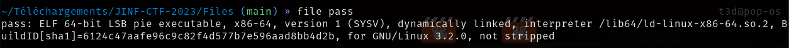
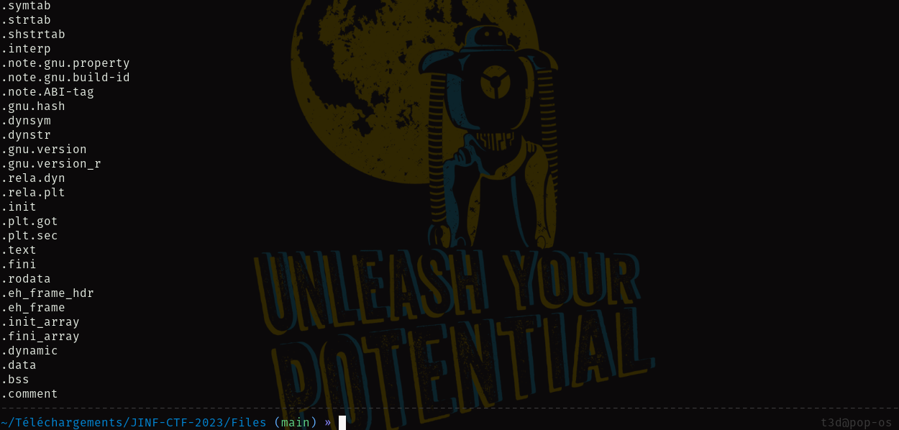
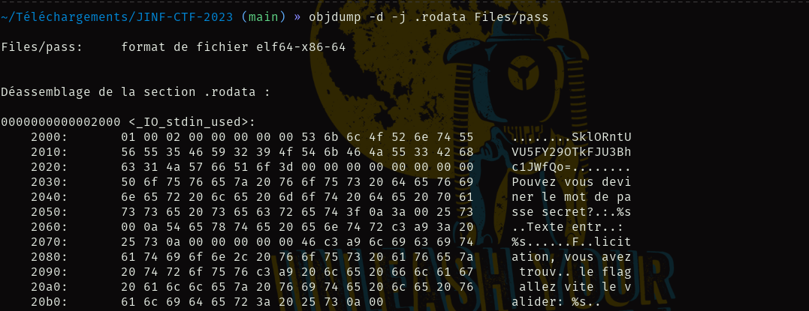
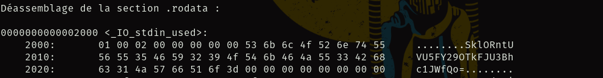

# JINF-CTF-2023 👨‍💻️

### Kira's_team 👨‍👨‍👦‍👦️
1. Kira `Captain` 👨‍✈️️
2. amo_weak 🕵️
3. Eddy 👨‍🔬️
4. Hyd3 🧙️

## Author: Hyd3 From Kira's_team

## Reverse Engineering Challenges
________________________________________________________
|Challenge		|Category	    	|Value  |
| ---------------------	|  ------------------	| ----- |
|[x] La devinette       | Reverse Engineering	|  100  |
|[x] Crack me		| Reverse Engineering	|  200  |
---------------------------------------------------------

	- La devinette
		- Premiere méthode
		- Seconde  méthode
	- Crack me
		- Premiere méthode
		- Seconde  méthode
		
#### Let's Go🏇️

## 1. La devinette

**Download** [pass](../Files/pass "pass") (Binary file)

1. Premiere méthode

>Tout d'abord pour savoir a quoi on doit s'attendre

```bash
file pass
```

`Output`:




Le binaire n'est pas strippé Dieu merci
>On ne s'agite pas on ne sait amais ce qui peut se passer avec un binaire , on pourrait avoir des informations utiles dans les 
`strings`


```bash
strings pass
```



Lâ on peut voir toutes les sections contenues dans le binaire

En Faisant des recherche vous verez que la section `.rodata` contient les données qui peuvent etre en clair dans le binaire 

Nous allons donc utilisé la commande `objdump` qui se trouve de base sur la plupart des distributions GNU/Linux


```bash
objdump -d -j .rodata Files/pass
```
### **Explication des parametres**

> `-d` : pour effectuer le desassemblage


> `-j` : pour preciser la section voulue

`Output`:




Ce qui est interessant dans l'output est vette chaine de caractere affiché avant le message .

```bash
Files/pass:     format de fichier elf64-x86-64


Déassemblage de la section .rodata :

0000000000002000 <_IO_stdin_used>:
    2000:	01 00 02 00 00 00 00 00 53 6b 6c 4f 52 6e 74 55     ........SklORntU
    2010:	56 55 35 46 59 32 39 4f 54 6b 46 4a 55 33 42 68     VU5FY29OTkFJU3Bh
    2020:	63 31 4a 57 66 51 6f 3d 00 00 00 00 00 00 00 00     c1JWfQo=........
    2030:	50 6f 75 76 65 7a 20 76 6f 75 73 20 64 65 76 69     Pouvez vous devi
    2040:	6e 65 72 20 6c 65 20 6d 6f 74 20 64 65 20 70 61     ner le mot de pa
    2050:	73 73 65 20 73 65 63 72 65 74 3f 0a 3a 00 25 73     sse secret?.:.%s
    2060:	00 0a 54 65 78 74 65 20 65 6e 74 72 c3 a9 3a 20     ..Texte entr..: 
    2070:	25 73 0a 00 00 00 00 00 46 c3 a9 6c 69 63 69 74     %s......F..licit
    2080:	61 74 69 6f 6e 2c 20 76 6f 75 73 20 61 76 65 7a     ation, vous avez
    2090:	20 74 72 6f 75 76 c3 a9 20 6c 65 20 66 6c 61 67      trouv.. le flag
    20a0:	20 61 6c 6c 65 7a 20 76 69 74 65 20 6c 65 20 76      allez vite le v
    20b0:	61 6c 69 64 65 72 3a 20 25 73 0a 00                 alider: %s..

```



